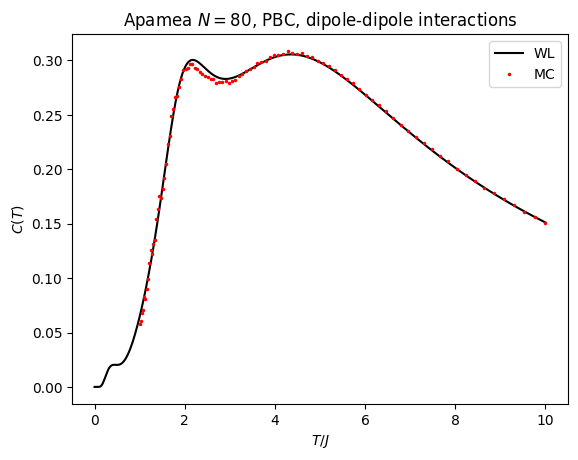

Универсальный алгоритм Wang-Landau
---

Универсальный алгоритм. Поддерживает магнитные системы заданные в формате `.mfsys` и `.csv`.

Сейчас алгоритм работает так, что бросает в ГС всегда, когда при проверке на плоскость гистограммы $H$ находит столбец с сильно меньшим от среднего значением. Этот подход неверный и годится только для тестов, т.к. недопосещенной может быть конфигурация при высоких энергиях.

# Сборка
```
mkdir build
cd build
cmake ..
cmake --build .
```

Если нужен вывод отладочной информации, то нужно на стадии cmake задать соответствующий флаг:
```
cmake -DENABLE_DEBUG_MESSAGES=ON ..
```

# Запуск

Пока в коде жестко прописаны следующие настройки: 
* решетка `apamea_4_4.mfsys`. 
* ПГУ (16 $\times$ 16 единиц)
* Радиус взаимодействия 5
* Число бинов: 10000
* Критерий плоскости: 75%
* Критерий сходимости: начальный $e^1$, конечный 1.00001
* Полный пересчет энергий каждые 1e7 шагов для сброса накопленной ошибки
* Сохранение в файл каждые 1e7 шагов
* random seed: 42

Запускать нужно из папки `test_apamea`:
```
cd test_apamea
../build/./wangLandauNew
```

Результат сохранится в файле `g.dat`.
Код работает примерно 3 минуты.

# Построение термодинамических свойств

В папке `test_apamea` лежит файл `average.c`. Собираем его:
```
gcc average.c -lm -o average
```

Запускаем усреднение с сохранением вывода в файл:
```
printf "g.dat\n0.001 10\n80\n" | ./average > apamea_N80_wl.out
```

Файл с результатами Метрополиса для сравнения: [test_apamea/apamea_N80_0.out](test_apamea/apamea_N80_0.out)

Код для построения:
```python
import numpy as np
import matplotlib.pyplot as plt
d = np.loadtxt("apamea_N80_0.out")
plt.plot(d[:,0], d[:,1], '.')
d = np.loadtxt("apamea_N80_wl.out")
plt.plot(d[:,0], d[:,2], '.')
```

Результат:


# todo

- [ ] Сменить алгоритм избежания застреваний
- [ ] 1/t алгоритм - добавить
- [ ] command-line parameters
- [ ] mpi/OMP параллелизм